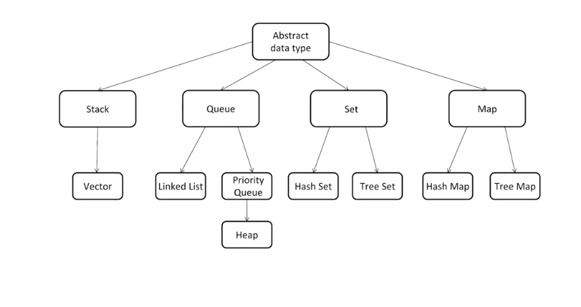
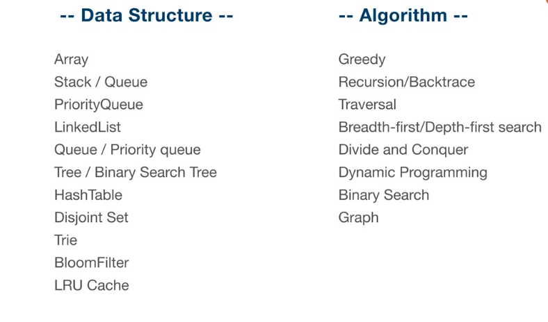

精通一个领域：

1. Chunk it up （将大的知识体系切碎，分割为小的知识点）
    

    
2. 刻意联系（弄清楚每个知识的买咯关联关系）
   练习自己不舒服的，进行不下去的领域
   和自己做斗争
   练习缺陷、弱点地方
   不爽 不舒服 跳出舒适区 枯燥
3. Feedback（反馈）
    及时反馈，主动反馈，找比自己强的人或者leetcode大佬
    被动反馈：有高手给你指点，codereview
   
4. 切题四件套
    先弄清楚题目意思，清晰题意；
    列举出所有的可能解决方案，然后对比每种解决方案的时间、空间复杂度
    多写
    测试案例

